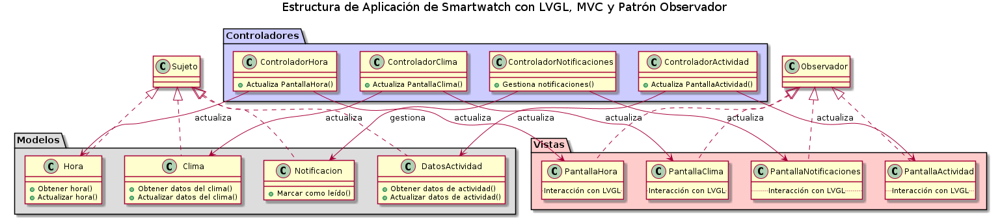

Para estructurar una aplicación de smartwatch utilizando LVGL y siguiendo el patrón Modelo-Vista-Controlador (MVC), complementado por el patrón Observador para la comunicación entre modelos y vistas, podemos organizar las clases y sus roles de la siguiente manera:

### Modelos
Son responsables de la lógica de negocio y el estado de la aplicación.

- **Hora**
  - **Rol**: Almacena y gestiona la hora actual.
  - **Operaciones**: Obtener hora, actualizar hora.
  
- **Clima**
  - **Rol**: Contiene datos del clima como temperatura y condiciones meteorológicas.
  - **Operaciones**: Obtener datos del clima, actualizar datos del clima.
  
- **Notificacion**
  - **Rol**: Representa una notificación con título, mensaje, origen y estado (leído/no leído).
  - **Operaciones**: Marcar como leído.
  
- **DatosActividad**
  - **Rol**: Almacena datos de actividad física, como pasos, distancia y calorías quemadas.
  - **Operaciones**: Obtener datos de actividad, actualizar datos de actividad.

### Vistas
Encargadas de la presentación y la interacción con el usuario.

- **PantallaHora**
  - **Rol**: Muestra la hora actual.
  - **Interacción con LVGL**: Usa widgets de LVGL para la visualización.
  
- **PantallaClima**
  - **Rol**: Muestra información sobre el clima.
  - **Interacción con LVGL**: Implementa widgets para mostrar datos del clima.
  
- **PantallaNotificaciones**
  - **Rol**: Lista las notificaciones recibidas.
  - **Interacción con LVGL**: Usa listas o contenedores de LVGL para mostrar notificaciones.
  
- **PantallaActividad**
  - **Rol**: Muestra los datos de actividad física.
  - **Interacción con LVGL**: Utiliza gráficos o barras de progreso de LVGL para representar los datos de actividad.

### Controladores
Manejan la lógica de interacción entre el usuario y la aplicación, comunicándose con los modelos y las vistas.

- **ControladorHora**
  - **Rol**: Actualiza la `PantallaHora` basándose en el modelo `Hora`.
  - **Interacciones**: Captura eventos de usuario para ajustes de hora, actualiza la vista con la hora actual.
  
- **ControladorClima**
  - **Rol**: Recupera datos del clima y actualiza la `PantallaClima`.
  - **Interacciones**: Maneja la solicitud de actualización de datos del clima, procesa y muestra la información en la vista.
  
- **ControladorNotificaciones**
  - **Rol**: Gestiona la recepción y administración de notificaciones.
  - **Interacciones**: Crea instancias de `Notificacion`, actualiza la `PantallaNotificaciones` con nuevas alertas.
  
- **ControladorActividad**
  - **Rol**: Recopila y procesa datos de actividad física, actualizando la `PantallaActividad`.
  - **Interacciones**: Maneja eventos de inicio/parada del seguimiento de actividad, muestra los datos recopilados en la vista.
  
- **ControladorNavegacion**
  - **Rol**: Gestiona la transicion de una vista a otra en funcion de los gestos que se detectan en el touch.
  - **Interacciones**: Transiciona hacia alguna de las clases de vistas PantallaHora, PantallaClima, PantallaNotificaciones,... .
  
### Patrón Observador
Facilita la actualización automática de las vistas cuando cambian los modelos.

- **Sujeto (Modelos)**
  - **Rol**: Notifica a las vistas observadoras sobre cualquier cambio en su estado.
  
- **Observador (Vistas)**
  - **Rol**: Actualiza la representación visual en respuesta a las notificaciones de los modelos.

### Flujo de Ejecución Típico
1. **Usuario interactúa** con la aplicación a través de la interfaz gráfica (Vista).
2. **Controlador recibe** la entrada del usuario, procesa la solicitud, y actualiza el Modelo si es necesario.
3. **Modelo notifica** a las Vistas (Observadores) sobre los cambios en los datos.
4. **Vistas se actualizan** automáticamente para reflejar el nuevo estado de los Modelos.

Este resumen ofrece una visión clara de cómo se estructura una aplicación de smartwatch con LVGL, utilizando el patrón MVC para separar la lógica de la aplicación, la gestión de datos y la presentación, mientras que el patrón Observador asegura que la UI se mantiene sincronizada con el estado actual de la aplicación.

